__________________________________________________________________Project Name

Marathon

____________________________________________________About the Author

Sofija Matvejeva

____________________________________________________Application Description

Android application for writers with AI assistant:
- Firebase Authentication
- Interactive chat with AI assistant
- Generation of Latvian names starting with a specific letter
- Creation of city lists starting with a specific letter
- Detailed character profile creation
- Saving dialogs in SQLite
- Dark and light mode switching

____________________________________________________Technologies Used

OpenAI API
Flask
ngrok
Android Studio
Firebase Authentication
SQLite

____________________________________________________Libraries Used

Flask: Web API creation
OpenAI: Working with AI models
Requests: HTTP requests
Logging: Event logging
JSON: Working with JSON data

____________________________________________________Installation

Git:
- Download and extract files
- Place the Maratons folder in the AndroidStudio folder that will appear when the program is downloaded
- Keep the python_api folder in any convenient location

Python 3.13.2:
- https://www.python.org/downloads/
- cd python_api
- pip install -r requirements.txt

ngrok:
- https://ngrok.com/downloads/windows?tab=download
- Register on the website
- cd ngrok
- ngrok config add-authtoken <token> (obtained after registration)

Android Studio:
- https://developer.android.com/studio
- Open the Maratons project in Android Studio
- File → Sync Project with Gradle Files

Smartphone with developer mode enabled:
- Settings → About phone → Tap Build number 7 times in a row → "You are now a developer!" notification

____________________________________________________Launch

Python 3.13.2:
- cd python_api
- python api.py

ngrok:
- cd ngrok
- ngrok http 5000 --region eu
- Copy the generated Forwarding URL that ends with .ngrok-free.app

Android Studio:
- open file app/java/com.example.maratons/ChatActivity.java
- update String API_URL = "https://your_link/api/chat"

Smartphone with developer mode enabled:
- Settings → System → {} For developers → tap on Wi-Fi debugging → enable Use Wi-Fi debugging → Connect device using QR code

Android Studio:
- Available devices → Pair Devices Using Wi-Fi
- Run 'app' or Shift + F10

____________________________________________________Architecture Diagram

+-------------------+       +-------------------+
|                   |       |                   |
|  Android App      |<----->|  Firebase Auth    |
|  (Client)         |       |                   |
|                   |       +-------------------+
+--------+----------+
         |
         | HTTP Requests
         |
+--------v----------+       +-------------------+
|                   |       |                   |
|  ngrok Tunnel     |<----->|  Flask API        |
|                   |       |  (Python Server)  |
|                   |       |                   |
+-------------------+       +---------+---------+
                                      |
                                      | API Calls
                                      |
                            +---------v---------+
                            |                   |
                            |  OpenAI API       |
                            |                   |
                            +-------------------+

____________________________________________________Screenshots

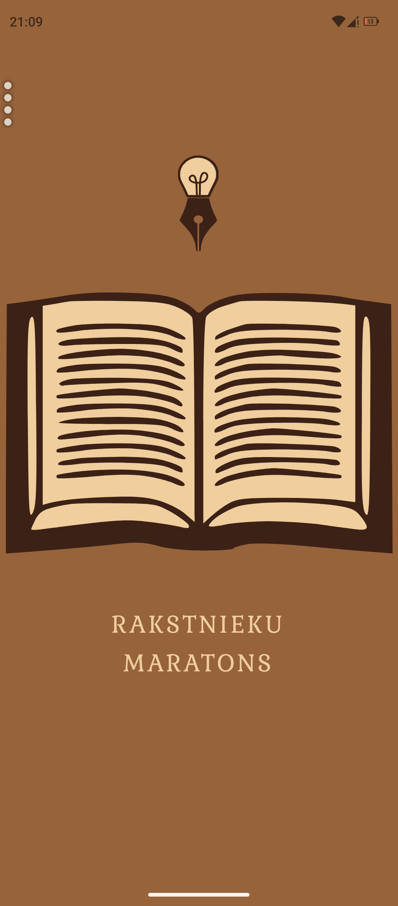 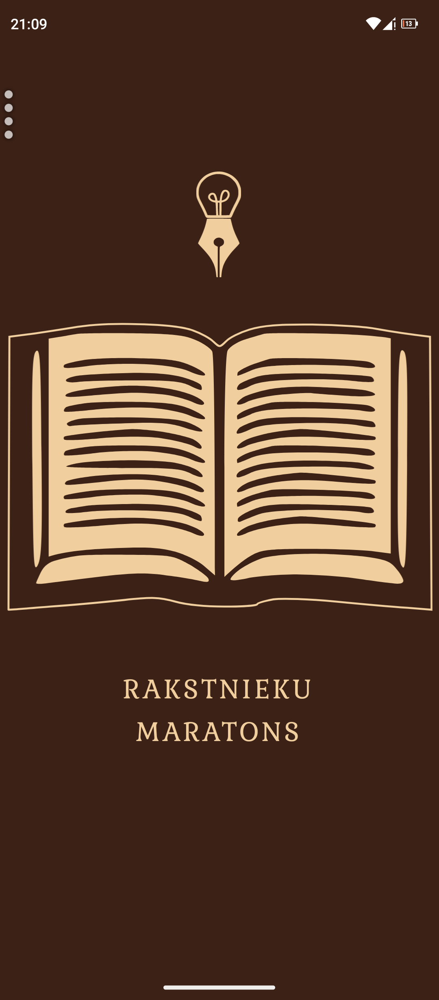

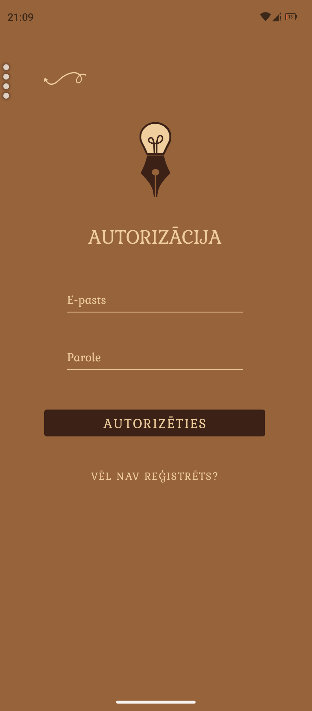 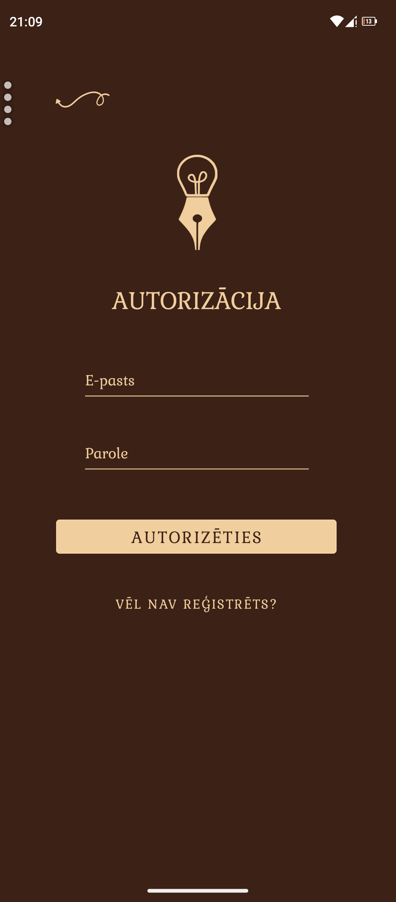

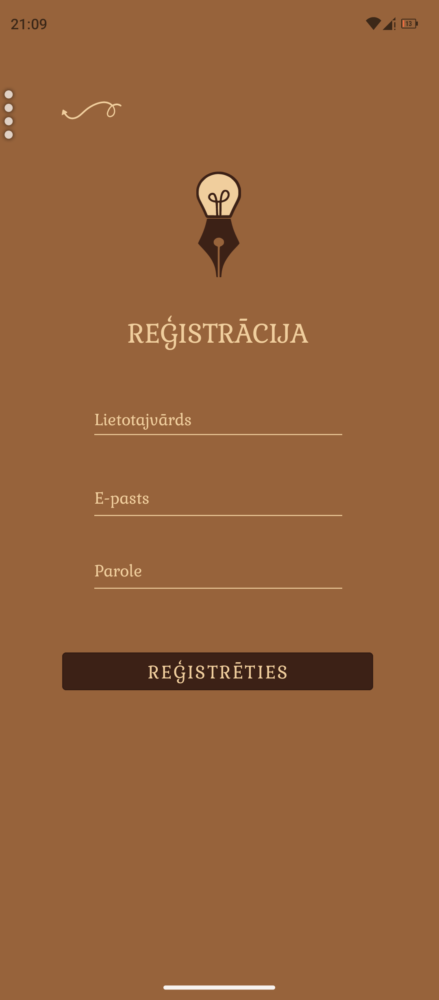 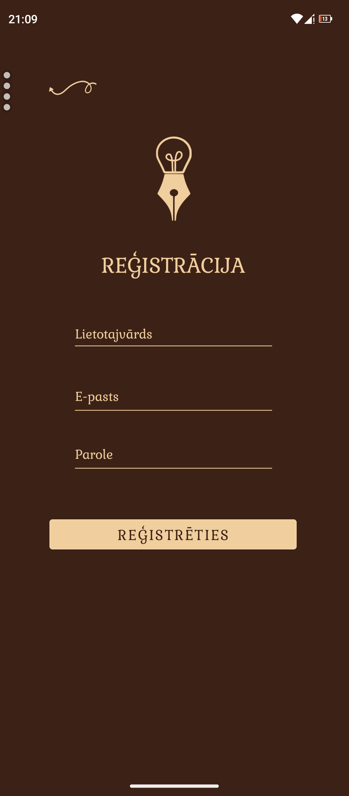

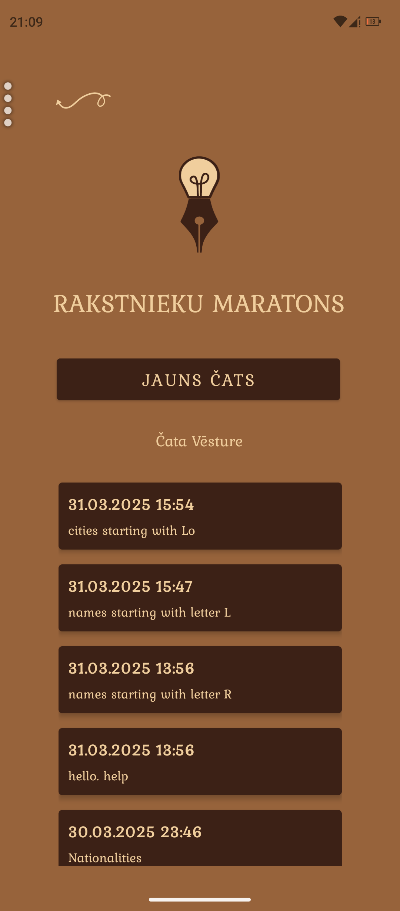 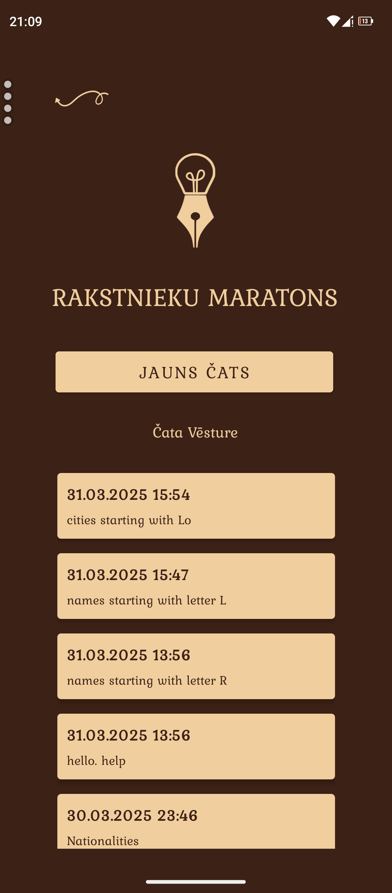

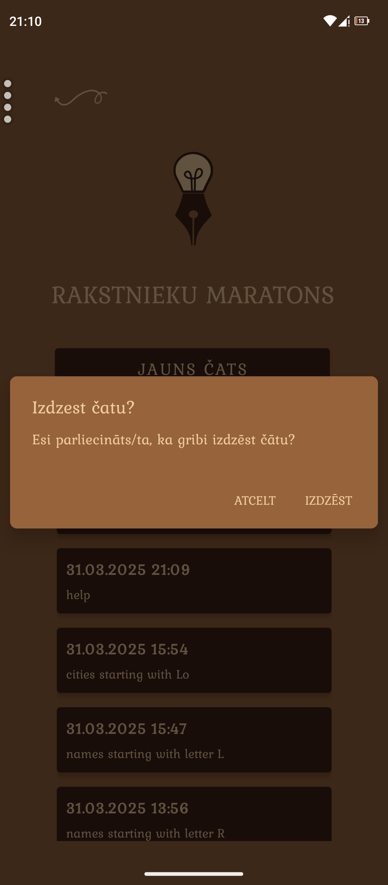 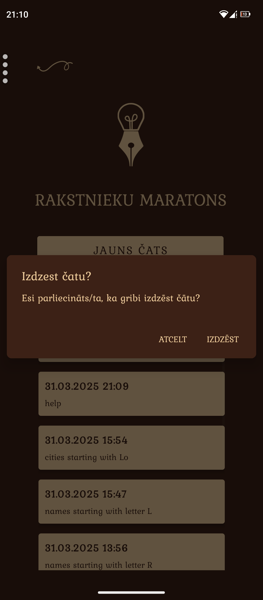

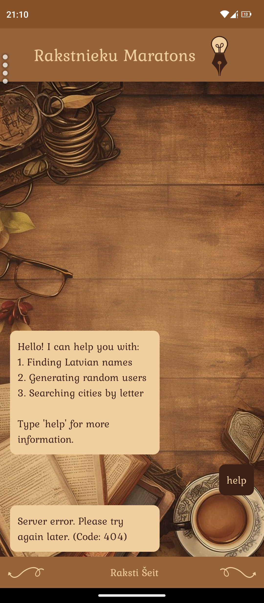 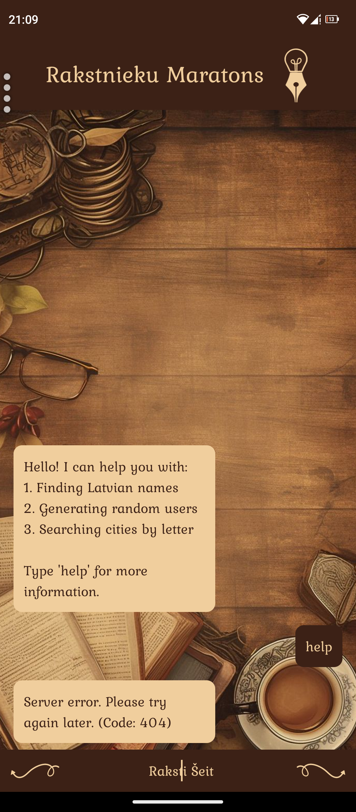

____________________________________________________Future Development Plans

- Add name filtering by gender
- Implement city search by letter combination
- Directly embed character images
- Add API with stories and proverbs
- Create assistant for generating writing marathon topics
- Add notes function
